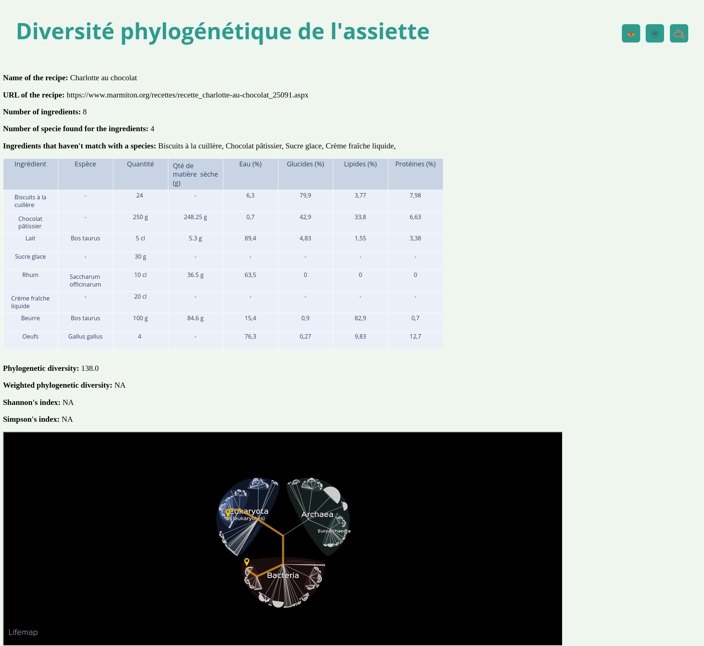

# Diversité phylogénétique: de l'assiette au jardin


<div style="text-align: center;"></div>

This project provide a tool to explore phylogenetic diversity of recipes by the french cooking website [marmiton.org](https://www.marmiton.org/). In this proposal we have develop a gui-based version and a cli-based version.

## Requirements:
- <b>python</b> (use system's Python and not Anaconda installation in order to have a better graphical render for the GUI)
- <b>pip</b>, you can install it running the following command:
```
sudo apt-get install python-pip
```

- <b>pipenv</b>, you need install it manually if you choose to use the GUI version (automatic installation for the CLI version). You can install it running the following command:
```
sudo apt-get install pipenv
```

## CLI version

If you have <b>python</b> and <b>pip</b> on your machine, normally you have all you need to run the CLI version. It checks automatically if <b>pipenv</b> is already installed, if not it is installed else it continues to check if the correct virtual environment is installed and if not, it installs all necessary dependencies.
So, you can run the CLI version with the following command:
```
./divAlim.sh [option] [file or url]
```

You can get command line help typing `./divAlim.sh` or `./divAlim.sh --help`. 
With the option `-u` you can process a single recipe from a URL:
```
./divAlim.sh -u https://www.marmiton.org/recettes/recette_risotto-milanais_24435.aspx
```
Otherwise, with the `-f` option you can process a text file that contain a single URL for each line (the file must haven't empty lines or any special symbol):
```
./divAlim -f 
```

In each case, the program will generate a `.html` report with the recipe name in the folder where you execute the program (see the example below).



## Before using, execute the following lines in your clone repo:

```
pipenv shell # create/activate a virtual environment using the repository
```

```
pipenv install -r requirements.txt # install all dependencies
```


Run `exit` to quit the venv.


## To execute the program:

```
python3 GUI.py # for application with graphic interface
```

or
```
python3 main.py # for the command line program</code>
```


Work on marmiton.org version of 26/04/2021


Contributors:
    - Barberis Tommaso
    - Deguise Victor
    - Frouté Timothée

(fork by http://pedago-service.univ-lyon1.fr:2325/tfroute/div-phylo-alim)
