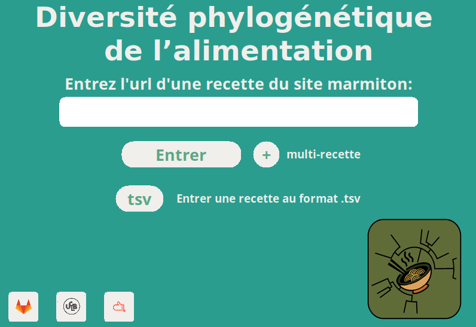
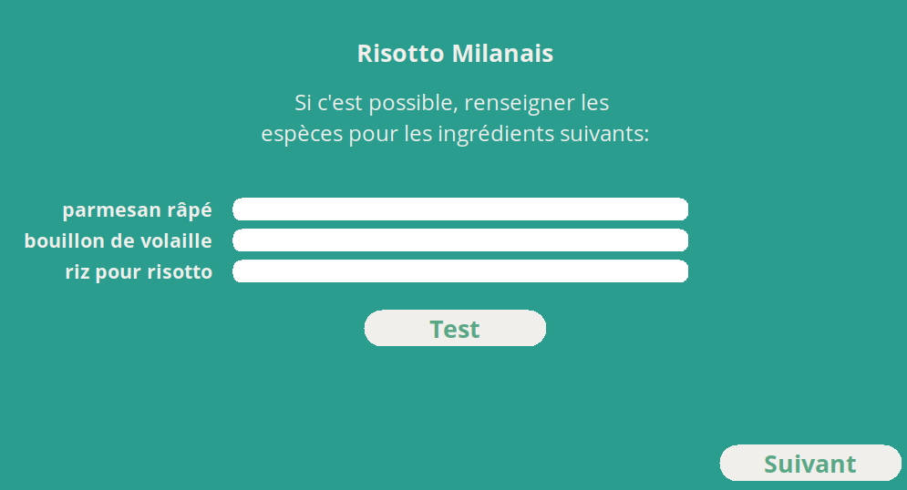
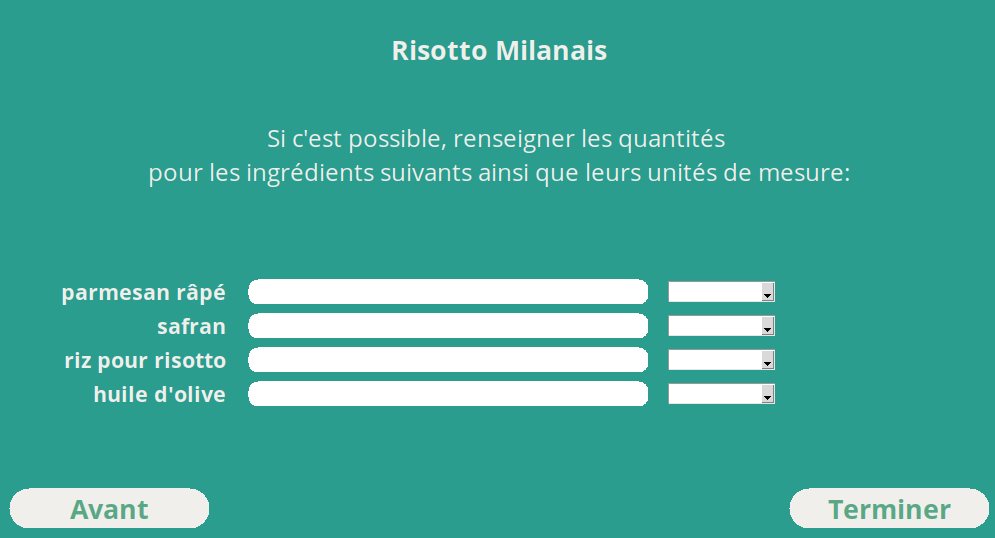
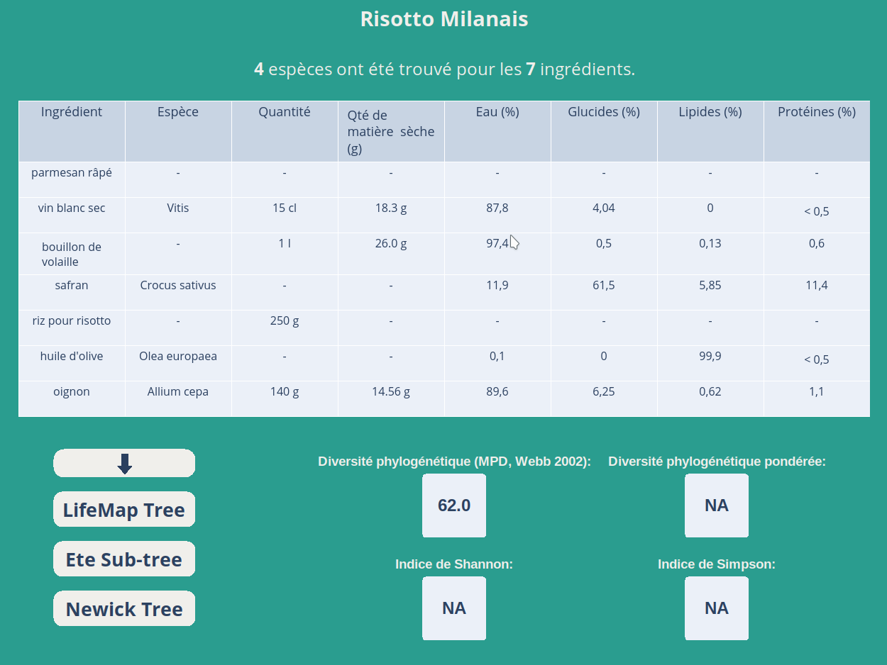

# Diversité phylogénétique: de l'assiette au jardin


<div style="text-align: center;"></div>

This project provide a tool to explore phylogenetic diversity of recipes by the french cooking website [marmiton.org](https://www.marmiton.org/). In this proposal we have develop a gui-based version and a cli-based version.

## Requirements:
- <b>python</b> (use system's Python and not Anaconda installation in order to have a better graphical render for the GUI)
- <b>pip</b>, you can install it running the following command:
```
sudo apt-get install python-pip
```

- <b>pipenv</b>, you need install it manually if you choose to use the GUI version (automatic installation for the CLI version). You can install it running the following command:
```
sudo apt-get install pipenv
```

## CLI version

If you have <b>python</b> and <b>pip</b> on your machine, normally you have all you need to run the CLI version. It checks automatically if <b>pipenv</b> is already installed, if not it is installed else it continues to check if the correct virtual environment is installed and if not, it installs all necessary dependencies.
So, you can run the CLI version with the following command:
```
./divAlim.sh [option] [file or url]
```

You can get command line help typing `./divAlim.sh` or `./divAlim.sh --help`. 
With the option <b>-u</b> you can process a single recipe from a URL:
```
./divAlim.sh -u https://www.marmiton.org/recettes/recette_risotto-milanais_24435.aspx
```
With the option <b>-t</b> you can process a tsv file as describe in the section <b>TSV file</b>:
```
./divAlim.sh -t file.tsv
```
Otherwise, with the <b>-f</b> option you can process a text file that contain a single URL for each line (the file must haven't empty lines or any special symbol):
```
./divAlim -f file.txt
```


In each case, the program will generate a `.html` report with the recipe name in the folder where you execute the program (see the example below).


## GUI version
### Before using, execute the following lines in your clone repo:

```
pipenv shell # create/activate a virtual environment using the repository
pipenv install -r requirements.txt # install all dependencies
```


Run `exit` to quit the venv and `pipenv shell` in the root folder of the project to reactivate the <b>venv</b> another time.


### To execute the program:

```
python GUI.py 
```

Here below some screenshot from the gui version:



How you can see, it is possible to enter a <b>URL</b> trough the entry widget as the <b>-u</b> option of the cli version and it is also possible process several recipes at the same time with the multi-recipe feature (like as the <b>-f</b> option) or a tsv file with the flag <b>-t</b>. So, with <b>multi-recipe</b> button allow to browser your files in order to select a text file which have one URL for each line (no empty line, no special symbols).




Here, we can see all the potential of the gui version, it allows you to complete data, more specifically about species scientific name and quantity, considering that data are obtained using a html parser. Below, an example of results on gui version.



Actually, gui version allows to browser phylogenetic tree of species with python's library <em>ete3</em>, copy in the clipboard the <b>Newick</b> tree and download the table at the `.tsv` format.

Both version allow you to display the phylogenetic tree in the <b>LifeMap Tree</b> (you can learn more about the LifeMap project [here](http://lifemap.univ-lyon1.fr/)).


## TSV file

In both <b>CLI</b> and <b>GUI</b> version, it is possible to enter a tsv file with one or more recipes. It must be as the following example:
```
recipe_name	ingredients	quantity	unit	url
Ratatouille	Aubergine	350	g	https://www.marmiton.org/recettes/recette_ratatouille_23223.aspx
Ratatouille	Courgette	350	g	https://www.marmiton.org/recettes/recette_ratatouille_23223.aspx
Ratatouille	Poivron	350	g	https://www.marmiton.org/recettes/recette_ratatouille_23223.aspx
Ratatouille	Tomate	500	g	https://www.marmiton.org/recettes/recette_ratatouille_23223.aspx
Ratatouille	Ail	120	g	https://www.marmiton.org/recettes/recette_ratatouille_23223.aspx
Ratatouille	Huile d'olive	90	g	https://www.marmiton.org/recettes/recette_ratatouille_23223.aspx
Ratatouille	Thym	5	g	https://www.marmiton.org/recettes/recette_ratatouille_23223.aspx
Ratatouille	Poivre	1	g	https://www.marmiton.org/recettes/recette_ratatouille_23223.aspx
Ratatouille	Sel	1	g	https://www.marmiton.org/recettes/recette_ratatouille_23223.aspx
Ratatouille	Oignon	350	g	https://www.marmiton.org/recettes/recette_ratatouille_23223.aspx
Ratatouille	Feuille de laurier	3	g	https://www.marmiton.org/recettes/recette_ratatouille_23223.aspx
```

So, the file must be a <em>Tabulation Separated Values</em>, it must have the header with the same names as the example for the columns (URL's column is optional).
Fields explication:
* recipe_name(string): it's the name of the recipe, it can be repeat on several line (each ingredient in a recipe has the same recipe's name);
* ingredients(string): name of the ingredients;
* quantity(int): quantity of the ingredients;
* unit(string): unit of the quantity. Unit between "g", "kg", "cl", "dl" and "l".


Work on marmiton version of <b>26/04/2021</b>


Contributors:
    - Barberis Tommaso
    - Deguise Victor
    - Frouté Timothée

(fork by http://pedago-service.univ-lyon1.fr:2325/tfroute/div-phylo-alim)
